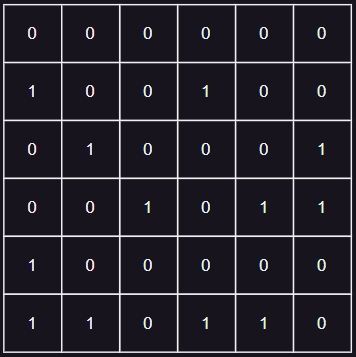
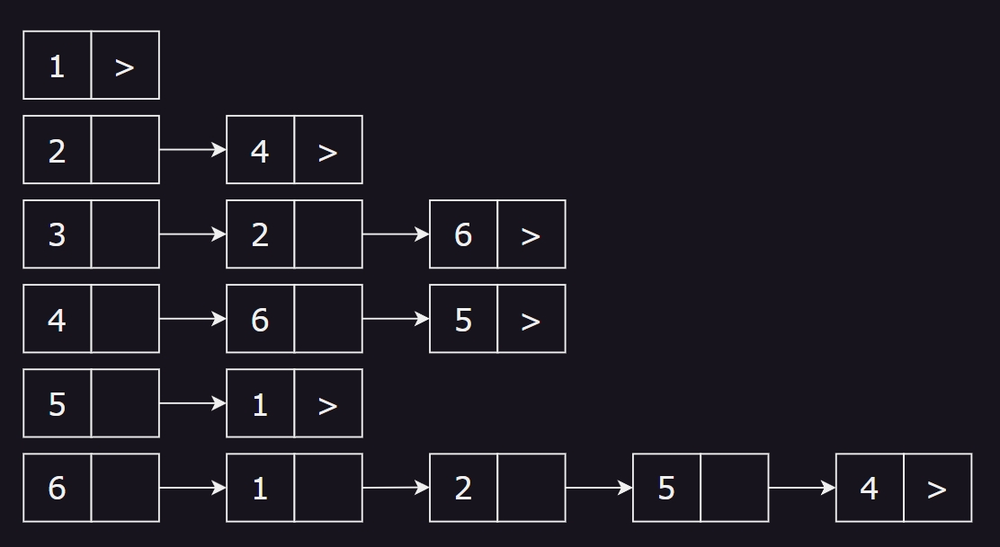
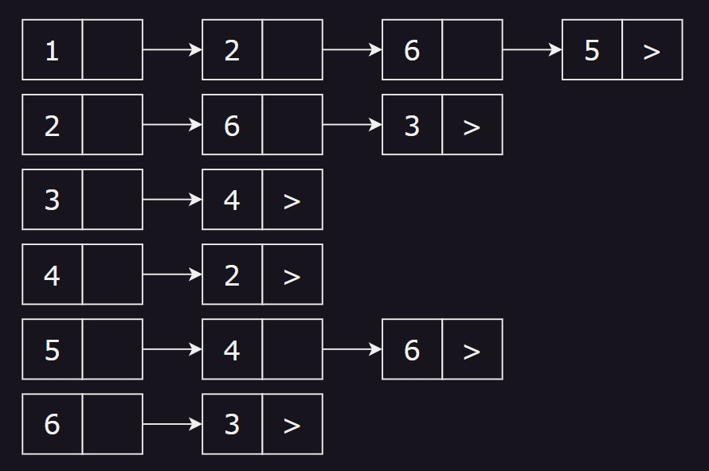

# 10.1&2

## 6.2.1

| 顶点 | 入度 | 出度 |
| :--: | :--: | :--: |
|  1   |  2   |  0   |
|  2   |  2   |  2   |
|  3   |  1   |  1   |
|  4   |  1   |  3   |
|  5   |  2   |  1   |
|  6   |  2   |  3   |

### 邻接矩阵



### 邻接表



### 逆邻接表



## 7.15

```cpp
#define MVNum 100

using namespace std;
typedef struct AMGraph
{
    vector<char> v;
    int arcs[MVNum][MVNum];
    int vnum;
    int arcnum;
} AMGraph;

class Graph
{
private:
    AMGraph graph;

public:
    Graph()
    {
        memset(graph.arcs, 0, sizeof(int) * MVNum * MVNum);
        graph.vnum = graph.arcnum = 0;
    }

    int LocateV(char v);

    bool InsertVex(char v)
    {
        if (graph.vnum == MVNum)
        {
            std::cout << "点数到达上线" << std::endl;
            return false;
        }
        auto it = find(graph.v.begin(), graph.v.end(), v);
        if (it != graph.v.end())
        {
            std::cout << "点已存在" << std::endl;
            return false;
        }
        graph.v.push_back(v);
        return true;
    }

    bool InsertArc(char v, char w)
    {
        auto itv = find(graph.v.begin(), graph.v.end(), v);
        auto itw = find(graph.v.begin(), graph.v.end(), v);
        if (itv == graph.v.end() || itw == graph.v.end())
        {
            std::cout << "v or w 不存在" << std::endl;
            return false;
        }
        int iv = LocateV(v);
        int iw = LocateV(w);

        graph.arcs[iv][iw] = 1;
        return true;
    }

    bool DeleteVex(char v)
    {
        auto it = find(graph.v.begin(), graph.v.end(), v);
        if (it == graph.v.end())
        {
            std::cout << "点不存在" << std::endl;
            return false;
        }
        graph.v.erase(it);
        return true;
    }

    bool DeleteArc(char v, char w)
    {
        auto itv = find(graph.v.begin(), graph.v.end(), v);
        auto itw = find(graph.v.begin(), graph.v.end(), v);
        if (itv == graph.v.end() || itw == graph.v.end())
        {
            std::cout << "v or w 不存在" << std::endl;
            return false;
        }
        int iv = LocateV(v);
        int iw = LocateV(w);

        graph.arcs[iv][iw] = 0;
        return true;
    }
};
```

## 7.21

```cpp
#include <vector>
#define MAX_V 20
typedef int ElemType, Status;
typedef int GraphKind; // 定义图的类型，无向图0， 有向图1，无向网2，有向网3

// 定义边的结点结构类型
typedef struct ArcNode
{
    int adjvex;
    int weight;
    struct ArcNode *next;
} ArcNode;

// 定义顶点的结构类型
typedef struct VexNode
{
    ElemType data;
    ArcNode *arclist;
} VexNode;

class ALGraph
{
private:
    VexNode vnode[MAX_V];
    int vexnum, arcnum;
    GraphKind type;

public:
    bool IsTrans()
    {

        for (int ix = 0; ix < vexnum; ix++)
        {
            for (ArcNode *ptr_x = vnode[ix].arclist; ptr_x != nullptr; ptr_x = ptr_x->next)
            {
                int y = ptr_x->adjvex;
                for (ArcNode *ptr_y = vnode[y].arclist; ptr_y != nullptr && ptr_y->adjvex != ix; ptr_y = ptr_y->next)
                {
                    int z = ptr_y->adjvex;
                    int flag = 0;
                    for (ArcNode *__ptr_x = vnode[ix].arclist; __ptr_x != nullptr; __ptr_x = __ptr_x->next)
                    {
                        if (__ptr_x->adjvex == z)
                        {
                            flag = 1;
                            break;
                        }
                    }
                    if (flag)
                        return false;
                }
            }
        }
        return true;
    }
};
```
