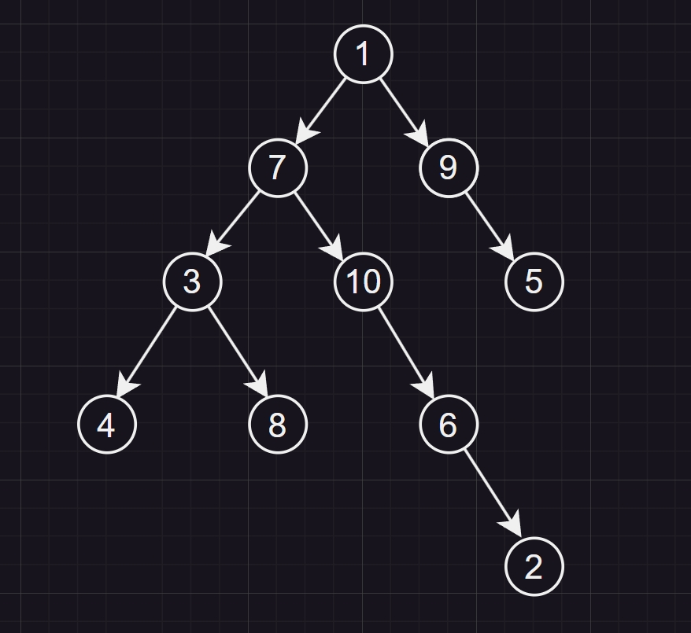

# 11.1

# 6.2.3




# 7.22

```cpp
#include <vector>
#include <stdlib.h>
#define MAX_V 20
typedef int ElemType, Status;
typedef int GraphKind; // 定义图的类型，无向图0， 有向图1，无向网2，有向网3

// 定义边的结点结构类型
typedef struct ArcNode
{
    int adjvex;
    int weight;
    struct ArcNode *next;
} ArcNode;

// 定义顶点的结构类型
typedef struct VexNode
{
    ElemType data;
    ArcNode *arclist;
} VexNode;

class Graph
{
private:
    VexNode vnode[MAX_V];
    int vexnum, arcnum;
    GraphKind type;

public:
    bool Is_Reachable(int vi, int vj)
    {
        if (vi < 0 || vi >= MAX_V || vj < 0 || vj >= MAX_V || vi == vj)
            exit(0);
        for (ArcNode *vtmp = vnode[vi].arclist; vtmp; vtmp = vtmp->next)
        {
            if (vtmp->adjvex == vj)
                return true;
            if (Is_Reachable(vtmp->adjvex, vj))
                return true;
        }
        return false;
    }
};

```
