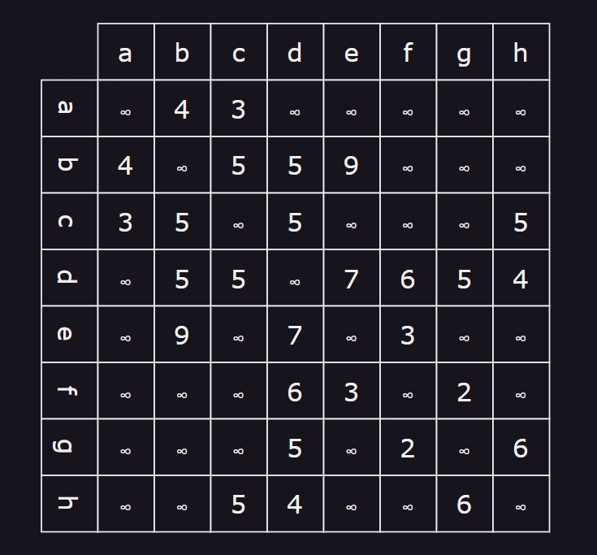
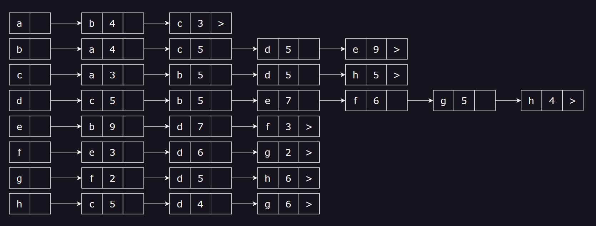
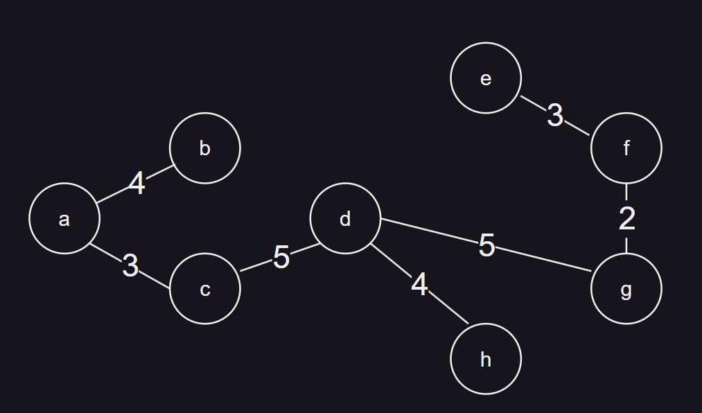

# 12.1

## 6.2.2

#### 邻接矩阵



#### 邻接表



#### 最小生成树



## 7.22

```java

void dfs(int[][] G, int[] vnum){
    visited =[false for i in range(0,vnum)]
    stack<int>=[0]
    while(!stack.empty())
    {
        int v=stack.pop()
        if(!visited[v])
        {
            print(vnum[v].id)
            visited[v]=true
            for(int i=0;i<vnum;i++)
            {
                if(G[v][i]!=0)
                    stack.push(i)
            }
        }
    }
}

```
