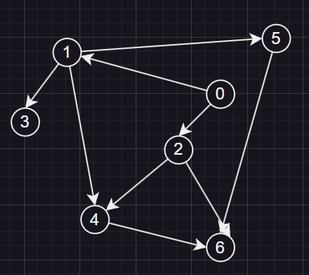

# 12.2

## p94.1

##### 画出有向图如下

### 排序过程为

##### 1.初始化空栈 stack[ ]，将 v0 入栈，stack=[v0]

##### 2.将 v0 出栈，输出 v0，删除 v0 边 stack=[ ]

##### 3.将 v1，v2 入栈，stack=[v1,v2]

##### 4.将 v2 出栈，输出 v2，删除 v2 边 stack=[v1]

##### 5.将 v1 出栈，输出 v1，删除 v1 边 stack=[ ]

##### 6.将 v3，v4，v5 入栈，stack=[v3,v4,v5]

##### 7.将 v5 出栈，输出 v5，删除 v5 边 stack=[v3，v4]

##### 8.将 v4 出栈，输出 v4，删除 v4 边 stack=[v3]

##### 9.将 v3 出栈，输出 v3，删除 v3 边 stack=[ ]

##### 10.将 v6，v7 入栈，stack=[v6]

##### 11.将 v6 出栈，输出 v6，删除 v6 边 stack=[ ]

##### 12.排序完成

## p94.2

### 排序结果如下

##### 1. v1 v2 v4 v3 v9 v8 v7 v6 v5

##### 2. v1 v2 v4 v3 v9 v7 v8 v6 v5

##### 3. v9 v8 v1 v2 v4 v3 v7 v6 v5

##### 4. v9 v8 v1 v2 v4 v7 v6 v3 v5

##### 5. v9 v8 v1 v2 v4 v7 v3 v6 v5

## p103

### 1

| 顶点  | v0  | v1  | v2  | v3  | v4  | v5  | v6  | v7  | v8  | 9   |
| :---: | :-: | :-: | :-: | :-: | :-: | :-: | :-: | :-: | :-: | --- |
| ve(i) |  0  |  5  |  6  | 18  | 21  | 21  | 23  | 25  | 28  | 30  |
| vl(i) |  0  | 15  |  6  | 18  | 22  | 26  | 23  | 26  | 28  | 30  |

### 2

##### 最少时间为 30

### 3

##### 关键路径是 v0->v2->v3->v6->v8->v9

##### 关键活动是 v0->v2，v2->v3，v6->v8，v8->v9
