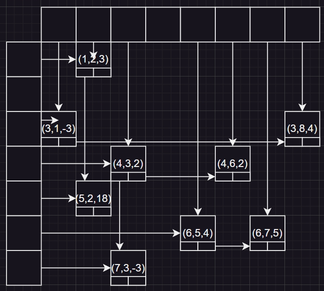

# 7.1

## 1

DBCAB BABBB ABDCBC

## 2

| Row | Col | Val |
| :-: | :-: | :-: |
|  1  |  2  |  3  |
|  3  |  1  | -3  |
|  3  |  8  |  4  |
|  4  |  3  |  2  |
|  4  |  6  |  2  |
|  5  |  2  | 18  |
|  6  |  5  |  4  |
|  6  |  7  |  4  |
|  7  |  3  | -3  |

