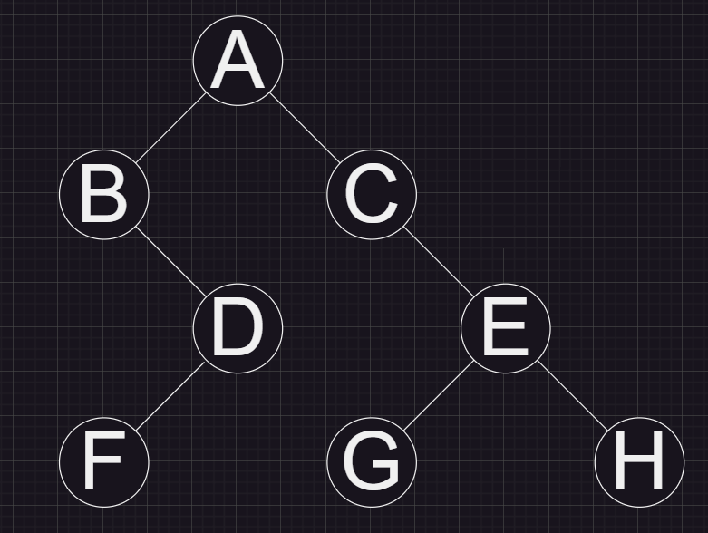

# 8.1

## 5.2.2.1



## 5.3.5

```cpp
#include <algorithm>
#include <iostream>
#include <queue>
#include <vector>

using namespace std;

typedef struct TreeNode
{
    int val;
    TreeNode *left;
    TreeNode *right;
    TreeNode(int x) : val(x), left(nullptr), right(nullptr) {}
} Tree;

int TreeWide(Tree *tree)
{
    if (tree == nullptr)
        return 0;
    queue<Tree *> t;
    t.push(tree);
    int cur_wide = 1;
    int max_wide = cur_wide;
    while (!t.empty())
    {
        int child_num = 0;
        for (int i = 0; i < cur_wide; i++)
        {
            Tree *child = t.front();
            t.pop();
            if (child->left != nullptr)
            {
                t.push(child->left);
                child_num++;
            }

            if (child->right != nullptr)
            {
                t.push(child->right);
                child_num++;
            }
        }
        max_wide = max(max_wide, child_num);
        cur_wide = child_num;
    }
    return max_wide;
}
```
